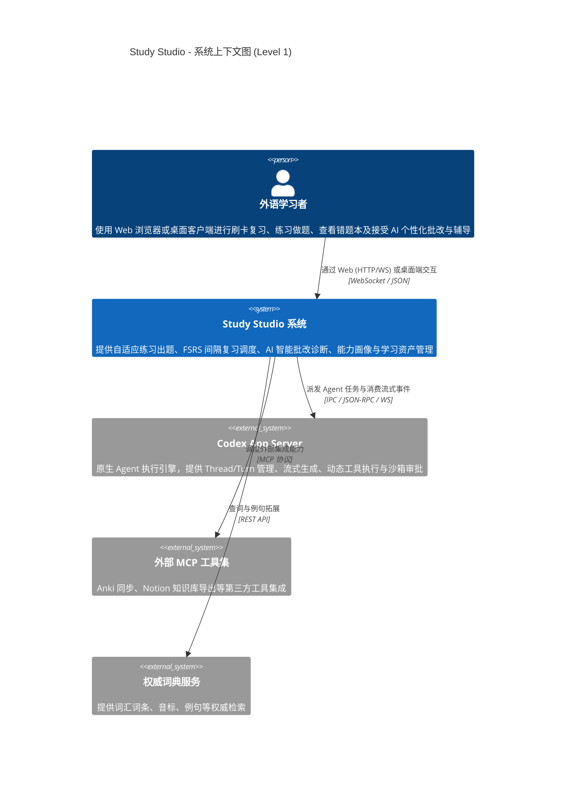
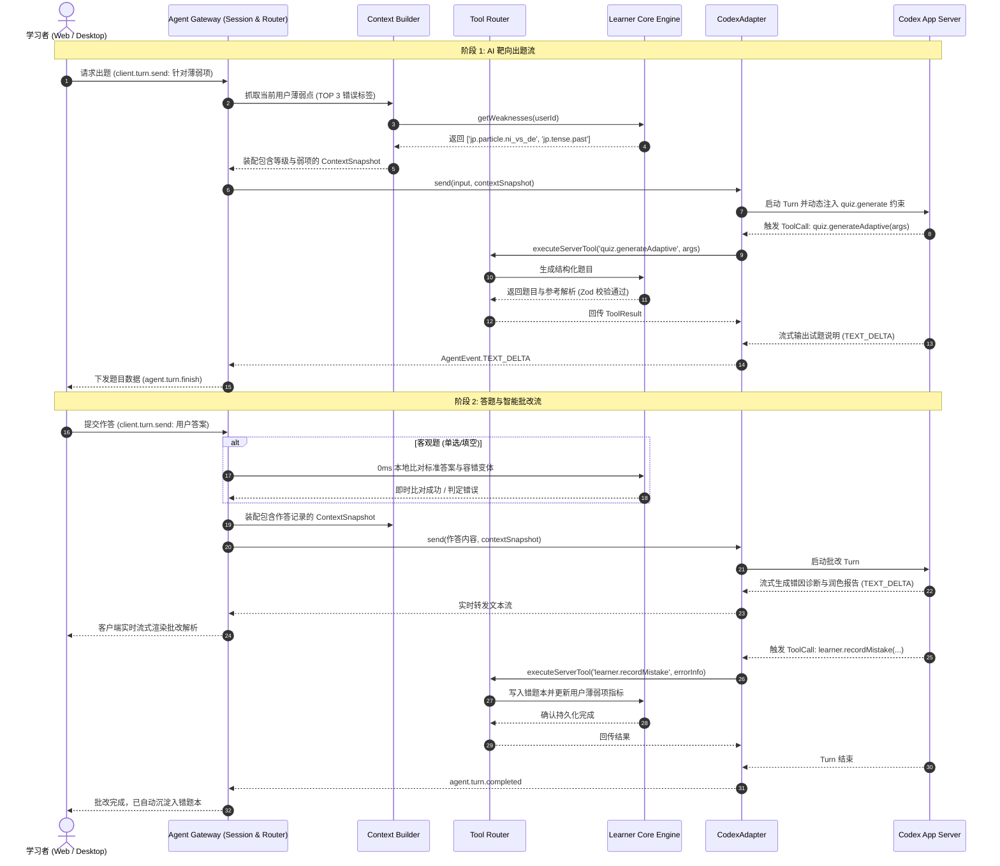

# Study Studio - 系统架构设计规格说明书 (System Architecture Specification)

> **文档版本**：v1.0  
> **维护责任人**：首席系统架构师  
> **核心架构原则**：单体模块化 (Modular Monolith)、强隔离适配层、学习者资产中心化、统一网关屏障

---

## 一、系统上下文架构 (C4 Context Diagram)



---

## 二、系统容器架构 (C4 Container Diagram)

```mermaid
C4Container
    title Study Studio - 容器与子系统图 (Level 2)

    Container_Boundary(c_client, "客户端层 (Client Layer)")
        Container(web_app, "Web 学习客户端 (apps/web)", "React 19, TypeScript, Vite, Tailwind, shadcn/ui", "展示学习卡片、答题界面、实时批改结果、错题本与优势/缺陷能力雷达")
        Container(desktop_shell, "桌面端外壳 (apps/desktop)", "Tauri v2 (Rust)", "包装 Web 产物，提供原生系统托盘、本地文件缓存与系统级快捷键")
    Container_Boundary_End()

    Container_Boundary(c_gateway, "服务端调度中枢 (Agent Gateway - apps/gateway)")
        Component(session_mgr, "Session Manager", "TypeScript", "管理连接生命周期、认证鉴权与学习者交互上下文")
        Component(context_bldr, "Context Builder", "TypeScript", "提取题干、答题结果、当前弱项标签组装 Context Snapshot")
        Component(agent_router, "Agent Router", "TypeScript", "四级路由 (DIRECT / FAST / REASONING / AGENT)")
        Component(tool_router, "Tool Router", "TypeScript", "调度 Client / Server / MCP 工具并做权限管控")
        Component(event_router, "Event Router", "TypeScript", "规范化双向 WebSocket 事件流")
    Container_Boundary_End()

    Container_Boundary(c_core, "核心领域引擎 (Domain Core Packages)")
        Component(learner_core, "Learner Core (packages/learner-core)", "TypeScript", "学习者画像、薄弱项统计、做题记录、错题本生命周期与 FSRS 算法")
        Component(agent_core, "Agent Core (packages/agent-core)", "TypeScript", "统一 AgentAdapter, AgentSession, AgentEvent 纯抽象")
        Component(tool_core, "Tool Core (packages/tool-core)", "TypeScript", "统一工具契约、Zod Schema 与权限定义")
    Container_Boundary_End()

    Container_Boundary(c_adapters, "Agent 适配器层 (Adapter Layer)")
        Component(codex_adapter, "CodexAdapter (packages/agent-codex)", "TypeScript", "对接 Codex App Server 原生 Thread/Turn/Item 事件流")
        Component(resp_adapter, "ResponsesAdapter (预留)", "TypeScript", "轻量化单次问答与极速批改适配")
    Container_Boundary_End()

    ContainerDb(db, "持久化存储 (Database)", "SQLite / PostgreSQL", "存储用户档案、熟练度指标、答题记录、错题记录与卡片状态")

    Rel(web_app, session_mgr, "建立长连接与数据交互", "WebSocket & HTTP")
    Rel(desktop_shell, web_app, "嵌入渲染", "Webview")
    Rel(session_mgr, context_bldr, "请求装配上下文", "In-Process")
    Rel(session_mgr, agent_router, "提交任务", "In-Process")
    Rel(agent_router, codex_adapter, "派发复杂 Agent 任务", "AgentAdapter 接口")
    Rel(codex_adapter, tool_router, "执行 Tool Call", "ToolRouter 接口")
    Rel(tool_router, web_app, "转发 Client Tools (如高亮)", "WebSocket")
    Rel(tool_router, learner_core, "执行 Server Tools (如记错题)", "In-Process")
    Rel(learner_core, db, "读写学习者数据与错题本", "Repository 模式")
```

---

## 三、客户端与数据库管理架构决策 (Tauri vs Next.js vs Vite)

针对用户的核心疑问：**“客户端采用 Tauri，数据库是放在 Tauri Rust 层管理更好，还是用 Next.js 这类框架直接对接更好？”**

经过深度架构权衡，我们确立了**“Vite Web 前端 + 模块化单体 Gateway 统一管库 + Tauri 零侵入外壳”**的最佳架构：

### 3.1 方案优缺点深度对比

| 评估维度 | 方案 A：Tauri Rust 直接管库 | 方案 B：Next.js 全栈直连 | 方案 C (采纳方案)：Gateway 统一管库 + Vite 前端 + Tauri 壳 |
| :--- | :--- | :--- | :--- |
| **多端同构性** | 差。浏览器 Web 端无法调用 Tauri Rust IPC，导致 Web 端必须重写一套网络层。 | 差。Next.js 的 SSR、Server Actions 与打包 Tauri 存在天然兼容冲突，且无法轻量打包进桌面壳。 | **极佳**。同一套 Web 前端在浏览器、Tauri 桌面端与未来移动端 100% 行为一致。 |
| **安装包与资源开销** | 极低 (~15MB)。 | 极大。若要兼顾本地无服务运行，桌面端需内置 Node.js 运行时，包体积超 150MB+。 | **极低**。Vite 构建产出纯静态 HTML/CSS/JS，桌面端包体积仅 15MB 左右。 |
| **数据库一致性** | 业务逻辑下沉到 Rust，需要维护复杂的 Rust SQL 与前端 TypeScript 序列化。 | 严重受限于 Vercel / Node 部署范式，不利于轻量离线运行。 | **极高**。在 Gateway 内通过 TypeScript ORM/Repository 统一管理，与领域模型零距离。 |
| **单机离线运行能力** | 纯本地单机原生支持。 | 强依赖外部服务或重型打包。 | **完全支持**。桌面端可直接以本地 Sidecar 方式拉起轻量 Gateway 进程（基于单一二进制），对外暴露相同端口。 |

### 3.2 架构实施原则
1. **统一由 Gateway 提供数据抽象**：
   - 数据库操作全部封装在 `packages/learner-core` 的 `LearnerRepository` 接口之后。
   - 业务、做题记录与错题本的 SQL 逻辑集中于 Gateway，绝不在前端散落裸露 SQL。
2. **Web 客户端轻量化 (`apps/web`)**：
   - 采用 **Vite + React 19**，开发体验极速，构建出标准的静态产物目录 `dist/`。
3. **Tauri 桌面端无缝接入 (`apps/desktop`)**：
   - Tauri 的 `tauri.conf.json` 中 `frontendDist` 直接指向 `../web/dist`，零适配成本打包成各平台桌面应用。

---

## 四、Agent Gateway 内部拓扑与流式做题/批改数据流



---

## 五、Tool 体系与三层权限模型

所有的工具必须向 `packages/tool-core` 注册，并声明以下属性：
1. **Name & Description**：语义化名称与模型易读描述。
2. **Location**：
   - `CLIENT`：客户端工具，网关通过 WebSocket 下发给 Web 客户端执行（如 UI 标注、短句发音）；
   - `SERVER`：服务端工具，网关本地直接执行（如词典查询、错题沉淀）；
   - `EXTERNAL`：外部工具，通过 MCP 适配器代理（如 Anki 同步）。
3. **Permission**：
   - `READ`：只读无害（无条件放行）；
   - `WRITE`：常规数据记录（默认自动允许，产生局部日志）；
   - `DESTRUCTIVE`：高危破坏性操作（如清空错题本，必须经用户确认）；
   - `SENSITIVE`：隐私与敏感权限（如麦克风长期监听，需客户端授权）。
