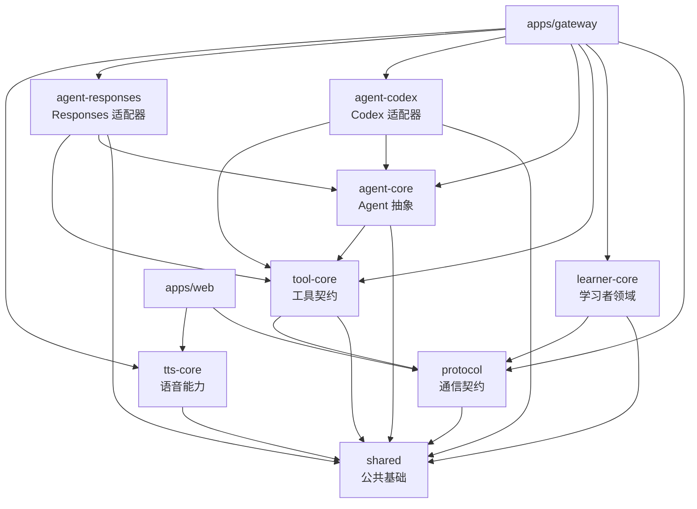

# `packages/` — 核心能力包阅读指南

`packages/` 是 Lingua Studio 的共享能力层。这里的代码会被 `apps/gateway`、`apps/web` 或 Agent 适配器复用，但不同 Package 的职责边界并不相同。

本目录采用的是**按能力拆分的模块化单体结构**：Package 不是独立部署的微服务，而是通过 workspace 依赖被同一个应用组合起来。

```text
packages/
├── shared             # 最底层公共基础能力
├── protocol           # 客户端 ↔ Gateway 的通信契约
├── learner-core       # 学习者领域规则和 Repository 契约
├── tool-core          # Agent Tool 契约、Schema、注册和权限
├── agent-core         # Agent 统一抽象
├── agent-codex        # Codex App Server 具体适配器
├── agent-responses    # Responses API 具体适配器
└── tts-core           # TTS 语音能力抽象和实现
```

---

## 1. 先理解 Package 层的分层关系

可以把这些包分成五组：

| 分组 | Package | 解决的问题 |
|---|---|---|
| 公共基础 | `shared` | Result、业务错误、日志、ID 和时间等通用能力 |
| 系统契约 | `protocol`、`agent-core`、`tool-core` | 定义模块之间稳定的类型和调用边界 |
| 学习领域 | `learner-core` | FSRS、错题、画像、计划和 Repository 契约 |
| 外部适配 | `agent-codex`、`agent-responses` | 把具体 Agent 厂商协议翻译成系统抽象 |
| 语音能力 | `tts-core` | TTS 请求、语音引擎、插件和发音匹配 |

整体依赖方向如下：



这里有一个重要判断：

> `apps/gateway` 是这些 Package 的组装者；Package 本身不应该反过来启动 Gateway、访问 UI 或绕过抽象直接连接其他运行时。

---

## 2. 推荐的阅读顺序

第一次阅读本目录，建议按照下面的顺序：

1. `shared`：先理解统一错误和 `Result` 风格。
2. `protocol`：理解客户端、Gateway 和学习功能之间交换什么数据。
3. `learner-core`：理解学习资产和领域规则由谁负责。
4. `tool-core`：理解 Agent 可以调用哪些能力，以及权限如何控制。
5. `agent-core`：理解所有 Agent 实现必须遵守的统一接口。
6. `agent-codex` / `agent-responses`：最后看具体厂商协议如何被封装。
7. `tts-core`：单独阅读语音请求和引擎插件体系。

每个包的入口都是：

```text
packages/<package>/src/index.ts
```

`package.json` 的 `main` 和 `types` 当前都指向 `src/index.ts`，所以源码入口和导出内容可以直接从该文件开始追踪。

---

# 3. `shared`：所有包共享的基础能力

路径：

```text
packages/shared/src/
```

这是依赖层级最低的公共包，不包含学习业务、UI 逻辑或模型厂商逻辑。

| 文件 | 作用 |
|---|---|
| `result.ts` | 提供 `Result<T, E>`、`ok`、`err` 等 Rust 风格结果类型。 |
| `errors.ts` | 定义 `BusinessError` 以及底层错误到业务错误的翻译能力。 |
| `logger.ts` | 统一日志门面；业务代码应使用这里的 logger，不要散落 `console.*`。 |
| `id.ts` | ID 生成和相关辅助。 |
| `time.ts` | 时间戳、日期和时间相关辅助。 |
| `index.ts` | 对外导出公共 API。 |
| `__tests__/` | 基础类型、错误和工具函数测试。 |

## 如何理解 `Result`

领域层、Repository、Tool 和 Agent Adapter 的失败不应随意抛出底层异常。推荐把可预期失败表达为：

```text
成功 → ok(value)
失败 → err(BusinessError)
```

例如：

```ts
Result<GradingResult, BusinessError>
```

这样 Gateway 可以统一决定：

- 返回什么协议错误码；
- 用户看到什么提示；
- 是否允许重试；
- 是否需要记录日志。

## 这里不应该放什么

不要把以下内容放到 `shared`：

- 日语助词判定规则；
- FSRS 算法；
- Codex 请求代码；
- 某个页面专用的 DTO；
- 只被一个领域使用的业务函数。

“被多个包使用”本身还不够，必须是稳定、通用且不属于某个领域的能力，才适合放到这里。

---

# 4. `protocol`：客户端和 Gateway 的通信契约

路径：

```text
packages/protocol/src/
```

`protocol` 定义系统对外交换的数据格式。它是客户端和 Gateway 之间的边界，不负责执行数据库操作，也不负责调用 Agent。

| 文件/目录 | 作用 |
|---|---|
| `envelope.ts` | 定义统一的 WebSocket 消息信封，如版本、消息 ID、Session ID、Turn ID、事件类型和载荷。 |
| `events.ts` | 定义客户端到 Gateway、Gateway 到客户端的事件类型。 |
| `schemas/quiz.ts` | 题目、作答和批改结构。 |
| `schemas/card.ts` | 卡片和复习相关结构。 |
| `schemas/textbook.ts` | 教材内容结构。 |
| `schemas/profile.ts` | 用户画像和学习者快照。 |
| `schemas/document.ts` | 文档、切片和批注结构。 |
| `schemas/kana.ts` | 假名课程和假名练习结构。 |
| `schemas/hangul.ts` | 韩文/字母课程结构。 |
| `schemas/reading.ts` | 阅读篇目和阅读题结构。 |
| `schemas/practice.ts` | 练习运行、题包和提交结构。 |
| `schemas/news.ts` | 新闻内容和来源结构。 |
| `schemas/turn-summary.ts` | Agent Turn 最终摘要。 |
| `schemas/learning-analysis.ts` | 学情分析结果。 |
| `schemas/practice-plan.ts` | 练习计划结构。 |
| `__tests__/` | 协议 Envelope、事件和 Schema 测试。 |

典型的 WebSocket 生命周期是：

```text
client.session.init
  → client.turn.send / client.quiz.submit
  → agent.turn.start
  → agent.text.delta（多次）
  → agent.tool.call / agent.approval.request（按需）
  → agent.turn.completed 或 agent.error
```

## 为什么协议包需要 Schema

客户端输入、WebSocket 消息、Agent Tool 输出都属于信任边界。类型声明只能帮助编译器，运行时仍然必须校验。

因此，正确的方向是：

```text
unknown 外部数据
  → Zod parse / safeParse
  → 合法的领域或协议类型
  → Gateway / UI 使用
```

结构化题包尤其不能只依赖 Agent 的自然语言输出；题目、批改卡和学习分析应当先通过 Schema 校验，再交给 UI。

## 这里不应该放什么

- 数据库表定义；
- FSRS 计算；
- Agent 厂商事件解析；
- HTTP 路由实现；
- React 组件状态。

`protocol` 只描述“可以传什么”，不负责“怎么执行”。

---

# 5. `learner-core`：学习者领域和唯一事实源

路径：

```text
packages/learner-core/src/
```

这是项目最重要的领域包之一。它负责学习者长期状态，而不是负责页面展示或模型对话。

| 文件 | 作用 |
|---|---|
| `types.ts` | 用户、语言档案、技能指标、卡片、答题、错题等领域类型。 |
| `profile.ts` | 学习者画像、技能指标和优势/弱项相关规则。 |
| `fsrs.ts` | FSRS 卡片调度和复习状态计算。 |
| `mistake.ts` | 错题创建、重做、连续答对和攻克状态。 |
| `daily-plan.ts` | 每日学习计划和学习活动。 |
| `practice-plan.ts` | 练习计划模型和相关规则。 |
| `card-templates.ts` | 词汇、语法、混淆句型等卡片模板。 |
| `repository.ts` | 定义 `LearnerRepository` 契约，不绑定具体 SQLite/Drizzle 实现。 |
| `index.ts` | 导出领域类型、规则和 Repository 契约。 |
| `__tests__/` | FSRS、画像、错题、计划等领域单元测试。 |

## 学习者数据的归属

以下数据属于用户学习资产，应由 `learner-core` 和 Repository 持久化：

- 熟练度和技能指标；
- 做题记录；
- 错题本；
- 错题重做和攻克状态；
- FSRS 卡片状态；
- 复习历史；
- 学习连续天数和活动记录；
- 学情分析所需的长期摘要。

Agent 可以读取 Gateway 组装的学习摘要，也可以通过受控 Tool 写入学习结果，但不能把模型 Thread 当成学习资产数据库。

## 典型调用关系

```text
Gateway / Domain Module
  → LearnerRepository
  → learner-core 定义的领域契约
  → Gateway 的 Drizzle/SQLite 实现
  → SQLite
```

`learner-core` 只定义“需要哪些数据和规则”，具体数据库实现位于 `apps/gateway/src/infrastructure/`。

## 这里不应该放什么

- Drizzle 查询和 SQLite 连接；
- Hono/HTTP 路由；
- Codex Prompt；
- React 页面状态；
- 依赖具体 Agent 的批改逻辑。

如果一个规则会影响“用户的学习事实”，优先考虑放在这里；如果只是把请求转给某个入口，则放到 Gateway 对应层。

---

# 6. `tool-core`：工具契约、注册和权限

路径：

```text
packages/tool-core/src/
```

`tool-core` 定义 Agent 可以调用的工具长什么样，但不负责实现所有具体业务工具。具体工具通常在 Gateway 的领域模块中实现。

| 文件 | 作用 |
|---|---|
| `tool.ts` | Tool 输入、输出、位置和执行契约。 |
| `permissions.ts` | Tool 权限等级和权限元数据。 |
| `registry.ts` | Tool 注册、查找和管理。 |
| `index.ts` | 对外导出工具 API。 |
| `__tests__/` | Tool、Registry 和权限测试。 |

## 工具位置

工具通常有三种位置：

| 位置 | 执行方 | 例子 |
|---|---|---|
| `SERVER` | Gateway 进程内 | 出题、批改、查词、记录错题 |
| `CLIENT` | Web/Tauri 客户端 | 跳转 Tab、高亮文本、展示题包 |
| `EXTERNAL` | 外部适配器 | Anki、Notion 等异构系统 |

调用链一般是：

```text
Agent 原生 tool_call
  → Gateway ToolRouter
  → Tool Registry
  → Tool.execute
  → 领域 application / persistence
  → ToolResult
  → AgentSession.submitToolResult
```

## 权限等级

Tool 还应声明风险级别，例如：

- `READ`：只读查询；
- `WRITE`：记录错题、更新熟练度等普通写入；
- `DESTRUCTIVE`：删除或清空数据，需要用户确认；
- `SENSITIVE`：麦克风、长期录音等敏感能力，需要客户端授权。

## MCP 的边界

学习域 Tool 优先使用引擎原生 function calling/dynamic tools，再由 Gateway `ToolRouter` 进程内执行。

MCP 只适合 Anki、Notion 等外部异构系统桥接，不应为了复用方便，把本仓库已经能够原生实现的学习能力额外绕一层 MCP。

---

# 7. `agent-core`：所有 Agent 的统一抽象

路径：

```text
packages/agent-core/src/
```

这是 Agent 层的“端口”（port），定义系统内部如何使用 Agent，但不包含 Codex 或其他厂商的具体协议。

| 文件 | 作用 |
|---|---|
| `adapter.ts` | `AgentAdapter` 契约，负责创建和恢复 Agent Session。 |
| `session.ts` | `AgentSession` 契约，负责发送输入、提交 Tool Result、提交审批、打断和关闭。 |
| `event.ts` | 统一的 `AgentEvent` 事件类型。 |
| `context.ts` | `AgentInput` 和 `ContextSnapshot` 类型。 |
| `index.ts` | 对外导出 Agent 抽象。 |

核心抽象包括：

```text
AgentAdapter
  → AgentSession
      → send(input): AsyncIterable<AgentEvent>
      → submitToolResult(...)
      → submitApproval(...)
      → interrupt()
      → close()
```

不同厂商的流式事件都应在 Adapter 内转换成统一事件，例如：

```text
TEXT_DELTA
REASONING_DELTA
TOOL_CALL_REQUESTED
TOOL_CALL_COMPLETED
APPROVAL_REQUESTED
ERROR
COMPLETED
```

## `ContextSnapshot` 的意义

`ContextSnapshot` 用来携带本轮已知的学习事实，例如：

- 目标语言和等级；
- 当前题目和用户答案；
- 当前选中的词；
- 最近弱项；
- UI 或学习上下文。

它的原则是：

```text
界面/Gateway 已知事实 → ContextSnapshot
需要查外部未知数据或写入变化 → Tool
```

不要通过 `getCurrentQuestion()`、`getUserAnswer()` 一类 Tool 让 Agent 反过来索取客户端已经知道的信息。

## 这里不应该放什么

- Codex App Server 的 JSON-RPC 细节；
- OpenAI Responses API 的具体请求格式；
- Gateway 的 Session Map；
- SQLite 查询；
- 某种模型专用 Prompt。

这些内容分别属于具体 Adapter 或 Gateway Runtime。

---

# 8. `agent-codex`：Codex App Server 原生适配器

路径：

```text
packages/agent-codex/src/
```

这是当前主要的 Agent 适配器。它把 Codex App Server 的原生 Thread/Turn/Item/dynamic tools/approval 能力封装成 `agent-core` 的统一接口。

| 文件/目录 | 作用 |
|---|---|
| `codex-adapter.ts` | 实现 `AgentAdapter`，负责创建/恢复 Codex Session。 |
| `app-server-client.ts` | App Server 客户端封装。 |
| `app-server-protocol.ts` | Codex App Server 的协议类型和消息定义。 |
| `event-mapper.ts` | 把 Codex 事件转换成系统 `AgentEvent`。 |
| `mapper.ts` | 请求、响应和结构化数据映射辅助。 |
| `tools-bridge.ts` | 把 Gateway Tool Definition 转换成 Codex dynamic tools，并桥接 Tool Call。 |
| `jsonrpc-stdio.ts` | 通过 stdio 处理 JSON-RPC 通信。 |
| `codex-error.ts` | Codex 底层错误到业务/Agent 错误的转换。 |
| `app-server/` | App Server 相关协议实现或辅助代码。 |
| `protocol-gen/` | 可选的协议生成物，对照使用，不作为普通 TypeScript 源码编译。 |
| `__tests__/` | Adapter、事件映射、协议和 Tool Bridge 测试。 |

典型映射关系：

| Codex 原生概念 | 系统抽象 |
|---|---|
| Thread | `AgentSession` |
| Turn | 一次 `send()` 调用周期 |
| Message Item | `AgentEvent.TEXT_DELTA` |
| Reasoning Item | `AgentEvent.REASONING_DELTA` |
| Dynamic Tool Call | `AgentEvent.TOOL_CALL_REQUESTED` |
| Approval Request | `AgentEvent.APPROVAL_REQUESTED` |

## 架构边界

`agent-codex` 可以依赖：

- `agent-core`；
- `tool-core`；
- `shared`。

但以下包和应用不应反向依赖它：

- `learner-core`；
- `protocol`；
- `tool-core`；
- `apps/web`。

这样未来更换模型时，Gateway 只需要替换或路由到另一个 Adapter，学习领域和前端不用感知。

## 本地运行相关配置

Codex 适配器会使用本机 Codex CLI/App Server。具体认证、沙箱、审批和模型配置见本包的 [`README.md`](./agent-codex/README.md)。

---

# 9. `agent-responses`：轻量 Responses 适配器

路径：

```text
packages/agent-responses/src/
```

该包实现与 `agent-core` 相同的 Agent 抽象，但面向更轻量、短生命周期的 Responses API 场景。

| 文件 | 作用 |
|---|---|
| `responses-adapter.ts` | Responses Adapter 的实现，负责把 Responses 请求、流式事件和 Tool Calling 转换成系统抽象。 |
| `index.ts` | 对外导出 Adapter。 |
| `__tests__/` | Responses Adapter 测试。 |

适合的场景包括：

- 简短词汇解释；
- 快速客观题解析；
- 短文本生成；
- 批量结构化内容生成；
- 对延迟和成本更敏感的轻量 Coach。

它是旁路适配器，不应削弱 Codex 的默认学习闭环。无论使用哪个 Adapter，工具都应最终进入 Gateway 的 Tool Registry/ToolRouter，而不是由 Adapter 私自修改数据库。

---

# 10. `tts-core`：文本转语音和发音能力

路径：

```text
packages/tts-core/src/
```

`tts-core` 把语音请求和具体语音引擎隔离开来，供 Web、Gateway 或桌面端复用。

| 文件 | 作用 |
|---|---|
| `types.ts` | 语音引擎、声音、请求和响应类型。 |
| `request.ts` | TTS 请求的构造和校验。 |
| `engine.ts` | TTS Engine 抽象和调度。 |
| `azure.ts` | Azure 语音引擎实现。 |
| `stub.ts` | 测试和离线开发用的 Stub 实现。 |
| `plugin.ts` | 引擎插件扩展机制。 |
| `voice-match.ts` | 根据语言、性别、音色等条件匹配声音。 |
| `index.ts` | 对外导出语音能力。 |
| `__tests__/` | 请求、引擎、声音匹配和插件测试。 |

语音能力和 Agent 能力是两条独立链路：

```text
用户点击发音
  → TTS 请求
  → tts-core Engine
  → 浏览器/本地/Azure 等语音实现
```

普通发音播放不需要经过 Agent。只有需要 Agent 进行发音诊断、跟读反馈或音素分析时，才由 Gateway 通过领域命令或 Tool 组织更复杂的流程。

---

# 11. 如何判断代码应该放到哪个 Package

可以按照“它回答什么问题”来判断：

| 代码回答的问题 | 放置位置 |
|---|---|
| 这是所有模块都能使用的错误、ID、时间或日志能力吗？ | `shared` |
| 客户端和 Gateway 之间传什么 JSON？ | `protocol` |
| 用户的熟练度、错题、卡片或计划如何变化？ | `learner-core` |
| Agent 能调用什么工具、工具有什么权限？ | `tool-core` |
| 系统如何创建 Agent、消费事件和提交 Tool Result？ | `agent-core` |
| 如何调用 Codex App Server？ | `agent-codex` |
| 如何调用 Responses API？ | `agent-responses` |
| 如何合成语音或匹配 Voice？ | `tts-core` |
| 如何接 HTTP/WS、SQLite 或具体领域用例？ | `apps/gateway` |
| 如何展示页面、管理查询缓存或 UI 偏好？ | `apps/web` |

最容易犯的错误是把“调用某个外部 API”误认为“业务逻辑”。正确的分解应该是：

```text
外部协议翻译 → Adapter / Engine
领域决策       → learner-core 或 Gateway module/application
数据库读写     → Gateway infrastructure / module persistence
入口适配       → Gateway transport 或 module/http
```

---

# 12. 典型跨 Package 数据流

## 12.1 Agent 生成练习

```text
apps/web
  → protocol: client.turn.send
  → apps/gateway: ContextBuilder
  → learner-core: 查询弱项摘要
  → agent-core: AgentInput + ContextSnapshot
  → agent-codex / agent-responses
  → tool-core: 原生 Tool Definition / Tool Call
  → apps/gateway: practice Tool 和 application
  → learner-core / protocol: 校验并返回结构化题包
  → apps/web: agent.text.delta + agent.turn.completed
```

## 12.2 用户提交答案

```text
apps/web
  → protocol: client.quiz.submit
  → apps/gateway: practice application
  → learner-core: 客观判题、记录学习事实
  → agent-core: 需要深度诊断时发送 Agent Turn
  → agent-codex: 流式解释和错因分析
  → tool-core: progress Tool
  → learner-core: 写入错题和技能指标
  → protocol: 批改卡、画像更新事件
```

## 12.3 Agent 调用客户端工具

```text
Agent
  → agent-core: TOOL_CALL_REQUESTED
  → apps/gateway: ToolRouter
  → tool-core: 发现 ToolLocation.CLIENT
  → protocol: agent.tool.call
  → apps/web: 执行 ui.navigate / ui.present
  → protocol: client.tool.result
  → apps/gateway
  → agent-core: submitToolResult()
```

---

# 13. 依赖和边界规则

## 13.1 Provider Zero Leak

核心领域和客户端不能依赖具体 AI 厂商包：

```text
learner-core / protocol / tool-core / apps/web
  ✕ 不得 import Codex、Responses、ACP 等具体厂商 SDK
```

它们只能通过 `agent-core` 定义的抽象与 Agent 交互。具体实现完全封装在 `agent-codex`、`agent-responses` 或未来的其他 Adapter 中。

## 13.2 学习者模型是 SSOT

`learner-core` 和数据库是用户学习资产的唯一事实源。Agent Thread 可以保存对话连续性，但不能替代：

- 错题本；
- FSRS 状态；
- 熟练度；
- 复习历史；
- 学习统计。

## 13.3 Context Snapshot 优先于反向 Read Tool

题干、答案、语言等级、当前 UI 焦点和近期错误等已知事实随 Turn 注入。不要增加“让 Agent 回头问客户端当前状态”的工具。

## 13.4 原生 Tool 优先于 MCP

学习域 Tool 应当走：

```text
Agent 原生 Tool Call
  → Gateway ToolRouter
  → tool-core Registry
  → 领域用例
```

只有外部异构系统同步等确有必要的场景才考虑 MCP。

## 13.5 类型和错误安全

- 不新增 `any`；
- 外部输入先使用 Zod 或显式类型守卫收窄；
- 底层异常翻译成 `BusinessError` 后再出 Gateway；
- 不把原始调用栈、厂商错误或网络错误直接展示给用户；
- `exactOptionalPropertyTypes` 下不要给可选字段显式赋 `undefined`。

## 13.6 静态数据登记

如果在 Package 或 Gateway 中新增：

- 演示题库；
- 静态词表；
- Mock 状态；
- seed 数据；
- 硬编码业务规则；

需要登记到：

```text
.studio-internal/STATIC-DATA-INVENTORY.md
```

---

# 14. 开发和验证

所有 Package 都是 workspace 成员，包内通常提供：

```bash
bun test
```

仓库级验证命令：

```bash
bun test
bun run typecheck
```

建议开发顺序：

1. 先在相应 Package 中定义稳定契约或领域规则；
2. 为核心规则补单元测试；
3. 在 Gateway 中添加 application、Tool 或 transport 入口；
4. 由 `protocol` 定义客户端需要的结构；
5. 最后在 Web/Tauri 中组合和展示。

不要先在 React 组件中写完整业务流程，再试图把逻辑倒推回 Package。

---

## 15. 一句话总结

```text
shared      = 所有人共用的基础设施
protocol    = 系统之间怎么说话
learner-core= 学习事实和学习规则
 tool-core  = Agent 能做什么以及能做到什么程度
agent-core  = 所有 Agent 的统一插座
agent-codex = Codex 插座的具体实现
agent-resp  = Responses 插座的具体实现
tts-core    = 语音能力的统一插座和引擎
```

理解 `packages/` 的关键不是记住每个文件名，而是先判断一段代码属于哪种职责：

> 公共基础、通信契约、学习领域、工具边界、Agent 抽象、外部适配，还是语音引擎？
>
> 先放进正确的边界，再让 Gateway 负责组装，整个系统才能在更换模型、增加客户端或扩展学习模块时保持稳定。